# CRM Project ER Diagram

This ERD is based on the Mongoose models in `backend/models`.

## Main ER Diagram

```mermaid
erDiagram
  USER ||--o{ USER : reportsTo
  USER ||--o{ LEAD : assignedTo
  USER ||--o{ DEAL : assignedTo
  USER ||--o{ ACTIVITY : owner
  USER ||--o{ NOTIFICATION : changedBy
  USER ||--o{ VIEW : userId
  USER ||--o{ DEAL_VIEW : userId

  ITEM ||--o{ LEAD : itemId
  ITEM ||--o{ CUSTOMER : product
  ITEM ||--o{ DEAL : product
  ITEM ||--o{ BILL_LINE_ITEM : itemId

  PRODUCT ||--o{ INVENTORY : product
  PRODUCT ||--o{ ORDER : product

  LEAD ||--o{ ACTIVITY : relatedTo
  CONTACT ||--o{ ACTIVITY : relatedTo
  DEAL ||--o{ ACTIVITY : relatedTo

  LEAD ||--o| CUSTOMER : convertedCustomer
  LEAD ||--o| CONTACT : convertedContact
  LEAD ||--o| DEAL : convertedDeal

  CUSTOMER ||--o{ DEAL : customerId
  DEAL ||--|| INVOICE : dealId
  INVOICE ||--o{ INVOICE_LINE_ITEM : lineItems
  INVOICE ||--o| PAYMENT : invoiceId
  INVOICE ||--o| INVOICE_PAYMENT_TOKEN : invoiceId
  PAYMENT ||--o| INVOICE_PAYMENT_TOKEN : paymentId

  VENDOR ||--o{ BILL : vendorId
  BILL ||--o{ BILL_LINE_ITEM : lineItems
  VENDOR ||--o{ PAYMENT : vendorId
  BILL ||--o{ PAYMENT : billId
  VENDOR ||--o{ VENDOR_ACTIVITY : vendorId

  DEAL ||--o{ NOTIFICATION : dealId
  LEAD ||--o{ NOTIFICATION : leadId

  USER {
    ObjectId _id PK
    String name
    String username
    String email
    String password
    String phone
    String department
    String designation
    String role
    String employee_id
    ObjectId reportsTo FK
    Object settings
    Date createdAt
    Date updatedAt
  }

  LEAD {
    ObjectId _id PK
    String salutation
    String firstName
    String lastName
    String name
    String title
    String company
    String email
    String phone
    String mobile
    String itemType
    ObjectId itemId FK
    String industry
    String gstin
    Number annualRevenue
    Number employeeCount
    String source
    Number score
    String rating
    Object address
    String status
    String notes
    ObjectId assignedTo FK
    ObjectId assignedBy FK
    Boolean isConverted
    ObjectId convertedCustomerId FK
    ObjectId convertedContactId FK
    ObjectId convertedDealId FK
    Array transitionHistory
    Object latestProposal
    Date createdAt
    Date updatedAt
  }

  CUSTOMER {
    ObjectId _id PK
    String name
    String email
    String phone
    String company
    String state
    String gstin
    ObjectId product FK
    ObjectId leadId FK
    String status
    String reason
    Date createdAt
    Date updatedAt
  }

  CONTACT {
    ObjectId _id PK
    ObjectId sourceLeadId FK
    ObjectId sourceDealId FK
    String name
    String company
    String email
    String phone
    String source
    Date convertedAt
    Date createdAt
    Date updatedAt
  }

  DEAL {
    ObjectId _id PK
    ObjectId customerId FK
    ObjectId sourceLeadId FK
    String name
    String company
    Number amount
    Number taxableAmount
    Number gstAmount
    Number grandTotal
    String email
    String phone
    Object address
    ObjectId product FK
    Number quantity
    Number reservedQuantity
    Date closingDate
    Number probability
    Number expectedRevenue
    String stage
    String status
    String paymentStatus
    ObjectId assignedTo FK
    Array timeline
    Object proposalDraft
    Boolean followUpCompleted
    Date createdAt
    Date updatedAt
  }

  ACTIVITY {
    ObjectId _id PK
    ObjectId leadId FK
    ObjectId createdBy FK
    String activityType
    String title
    String description
    ObjectId owner FK
    String status
    String priority
    Date dueDate
    Date startDateTime
    Date endDateTime
    Object relatedTo
    Object task
    Object meeting
    Object call
    String outcome
    Boolean requiresFollowUp
    String stage
    Date completedAt
    Date cancelledAt
    Date createdAt
    Date updatedAt
  }

  ITEM {
    ObjectId _id PK
    String name
    String normalizedName
    String type
    String category
    Number price
    Number gst_percent
    String hsn_sac
    Number cost
    Number stock
    Number reservedStock
    Number soldStock
    Number lowStockThreshold
    String vendor
    String location
    String serviceType
    String billingCycle
    String status
    String sku
    String description
    Date createdAt
    Date updatedAt
  }

  PRODUCT {
    ObjectId _id PK
    String name
    String sku
    String category
    Number price
    String description
    Number stock
    Date createdAt
    Date updatedAt
  }

  INVENTORY {
    ObjectId _id PK
    ObjectId product FK
    Number quantity
    Date date
    Date createdAt
    Date updatedAt
  }

  ORDER {
    ObjectId _id PK
    ObjectId product FK
    String clientEmail
    ObjectId clientHandlerId FK
    String status
    Date createdAt
    Date updatedAt
  }

  INVOICE {
    ObjectId _id PK
    String invoiceNumber
    ObjectId dealId FK
    ObjectId assignedTo FK
    String customerName
    String company
    String email
    String phone
    Date issueDate
    Date dueDate
    String currency
    Number subtotal
    Number gstAmount
    Number totalAmount
    String status
    Array lineItems
    ObjectId createdBy FK
    Date createdAt
    Date updatedAt
  }

  INVOICE_LINE_ITEM {
    ObjectId _id PK
    String product
    Number quantity
    Number unitPrice
    Number gstPercent
    Number taxableAmount
    Number totalAmount
  }

  VENDOR {
    ObjectId _id PK
    String vendorName
    String companyName
    String email
    String phone
    String gstNumber
    String address
    String city
    String state
    Array productsProvided
    Array servicesProvided
    String status
    Date createdAt
    Date updatedAt
  }

  BILL {
    ObjectId _id PK
    ObjectId vendorId FK
    String billNumber
    Number amount
    Array lineItems
    Boolean inventorySynced
    String status
    Date purchaseDate
    Date dueDate
    String notes
    Date createdAt
    Date updatedAt
  }

  BILL_LINE_ITEM {
    ObjectId _id PK
    ObjectId itemId FK
    String type
    String product
    Number quantity
    Number unitPrice
    Number subtotal
    Number gstPercent
    Number taxAmount
    Number total
  }

  PAYMENT {
    ObjectId _id PK
    String paymentSource
    ObjectId vendorId FK
    ObjectId billId FK
    ObjectId invoiceId FK
    Number amount
    String paymentMode
    String transactionId
    Date paymentDate
    Date createdAt
    Date updatedAt
  }

  VENDOR_ACTIVITY {
    ObjectId _id PK
    ObjectId vendorId FK
    String action
    String entityType
    ObjectId entityId
    String message
    Object metadata
    Date createdAt
    Date updatedAt
  }

  NOTIFICATION {
    ObjectId _id PK
    ObjectId dealId FK
    ObjectId leadId FK
    String message
    String fromStage
    String toStage
    ObjectId changedBy FK
    String changedByName
    Array recipients
    Boolean isRead
    Date createdAt
    Date updatedAt
  }

  VIEW {
    ObjectId _id PK
    String name
    ObjectId userId FK
    Object filters
    Array columns
    Object sort
    String module
    String visibility
    Date createdAt
    Date updatedAt
  }

  DEAL_VIEW {
    ObjectId _id PK
    String name
    ObjectId userId FK
    Object filters
    Array columns
    Object sort
    String visibility
    Date createdAt
    Date updatedAt
  }

  INVOICE_PAYMENT_TOKEN {
    ObjectId _id PK
    String token
    String transactionId
    ObjectId invoiceId FK
    Number amount
    String status
    Date paidAt
    Date expiresAt
    ObjectId paymentId FK
    Date createdAt
    Date updatedAt
  }

  ACCOUNT {
    ObjectId _id PK
    String name
    String normalizedName
    String industry
    String phone
    String email
    String status
    Boolean isDeleted
    Date createdAt
    Date updatedAt
  }

  APP_SETTINGS {
    ObjectId _id PK
    String companyName
    String companyState
    String companyGstin
    String supportEmail
    Object branding
    Object security
    Object automation
    Object pipeline
    Object leadManagement
    Object invoiceDefaults
    Object notificationDefaults
    Object userAccess
    Object customization
    Object integrations
    Object systemConfiguration
    Object email
    String frontendUrl
    String backendUrl
    Date createdAt
    Date updatedAt
  }
```

## Relationship Summary

| Relationship | Description |
| --- | --- |
| `User -> User` | A user can report to another user through `reportsTo`. |
| `User -> Lead` | Leads are assigned to users through `assignedTo`; assignment can also be tracked with `assignedBy`. |
| `User -> Deal` | Deals are assigned to users through `assignedTo`. |
| `Lead -> Customer` | A converted lead can create one customer through `convertedCustomerId`; customer also stores `leadId`. |
| `Lead -> Contact` | A converted lead can create one contact through `convertedContactId`; contact also stores `sourceLeadId`. |
| `Lead -> Deal` | A converted lead can create one deal through `convertedDealId`; deal also stores `sourceLeadId`. |
| `Customer -> Deal` | One customer can have many deals through `customerId`. |
| `Item -> Lead/Customer/Deal` | Items are selected in leads, customers, and deals. |
| `Activity -> Lead/Contact/Deal` | Activity uses `relatedTo.recordType` and `relatedTo.recordId` as a polymorphic relation. |
| `Deal -> Invoice` | Each invoice belongs to one deal; `dealId` is unique in invoices. |
| `Invoice -> Payment` | Client invoice payment links through `invoiceId`. |
| `Vendor -> Bill` | One vendor can have many bills. |
| `Bill -> Payment` | Vendor bill payment links through `billId`. |
| `Vendor -> VendorActivity` | Vendor activity logs actions for vendors, bills, and payments. |
| `Product -> Inventory/Order` | Product stock is tracked through inventory entries and restock orders. |
| `Deal/Lead -> Notification` | Notifications can be attached to deal or lead stage changes. |
| `User -> View/DealView` | Saved table views belong to users. |
| `Invoice -> InvoicePaymentToken` | Invoice payment links/tokens belong to invoices and can later point to a payment. |
| `Account` | Standalone account/company master collection. |
| `AppSettings` | Singleton-style application configuration collection. |

## Notes

- `Item` is stored in the `products` collection and represents both products and services.
- `Product` is a separate legacy/simple product model used by `Inventory` and `Order`.
- `Activity.relatedTo` is polymorphic, so it can point to `Lead`, `Contact`, or `Deal`.
- `Payment` is also conditional: it links either to a vendor bill or a client invoice depending on `paymentSource`.

## Complete Field List

The list below uses dot notation for nested objects and `[]` for array subdocuments.

### Account

| Field | Type | Notes |
| --- | --- | --- |
| `_id` | ObjectId | Primary key |
| `name` | String | Required |
| `normalizedName` | String | Required, unique |
| `industry` | String |  |
| `phone` | String |  |
| `email` | String |  |
| `status` | String | `active`, `inactive` |
| `isDeleted` | Boolean |  |
| `createdAt` | Date | Timestamp |
| `updatedAt` | Date | Timestamp |

### Activity

| Field | Type | Notes |
| --- | --- | --- |
| `_id` | ObjectId | Primary key |
| `leadId` | ObjectId | FK `Lead` |
| `type` | String | `call`, `email`, `meeting`, `task` |
| `notes` | String |  |
| `nextFollowUpDate` | Date |  |
| `createdBy` | ObjectId | FK `User` |
| `activityType` | String | Required; `task`, `meeting`, `call`, `email` |
| `title` | String | Required |
| `description` | String |  |
| `owner` | ObjectId | Required; FK `User` |
| `status` | String |  |
| `priority` | String | `Low`, `Medium`, `High` |
| `dueDate` | Date |  |
| `startDateTime` | Date |  |
| `endDateTime` | Date |  |
| `location` | String |  |
| `participants[]` | String |  |
| `reminderTime` | Date |  |
| `reminderChannels.popup` | Boolean |  |
| `reminderChannels.email` | Boolean |  |
| `recurrence` | String | `none`, `daily`, `weekly`, `monthly` |
| `relatedTo.recordType` | String | Required; `Lead`, `Contact`, `Deal` |
| `relatedTo.recordId` | ObjectId | Required; dynamic FK by `recordType` |
| `relatedTo.recordName` | String |  |
| `task.taskTitle` | String |  |
| `meeting.meetingTitle` | String |  |
| `meeting.meetingType` | String | `Call`, `Video Meeting` |
| `meeting.meetingLink` | String |  |
| `meeting.reminder` | Date |  |
| `call.callSubject` | String |  |
| `call.callType` | String | `Inbound`, `Outbound` |
| `call.callDuration` | Number |  |
| `call.callNotes` | String |  |
| `call.callStatus` | String | `Scheduled`, `Ringing`, `In Progress`, `Missed`, `Completed` |
| `call.provider` | String |  |
| `call.providerCallSid` | String |  |
| `call.providerStatus` | String |  |
| `call.toNumber` | String |  |
| `call.fromNumber` | String |  |
| `call.teamsLink` | String |  |
| `call.teamsMode` | String | `voice`, `video`, empty |
| `outcome` | String | `interested`, `not_interested`, `no_response`, `follow_up_needed`, empty |
| `outcomeReason` | String |  |
| `requiresFollowUp` | Boolean |  |
| `stage` | String | `contacted`, `meeting`, `qualified`, empty |
| `followUpType` | String | `task`, `meeting`, `call`, empty |
| `followUpInDays` | Number | 1-30 |
| `followUpGeneratedAt` | Date |  |
| `serviceBilling.servicePlan` | String |  |
| `serviceBilling.billingCycle` | String |  |
| `serviceBilling.customCycleValue` | String |  |
| `serviceBilling.customCycleUnit` | String |  |
| `serviceBilling.usersOrSeats` | String |  |
| `serviceBilling.estimatedValue` | String |  |
| `serviceBilling.billingOwner` | String |  |
| `serviceBilling.reminderDays` | String |  |
| `serviceBilling.renewalPolicy` | String |  |
| `serviceBilling.serviceContinuationDecision` | String |  |
| `serviceBilling.billingNotes` | String |  |
| `serviceBilling.nextCustomerEmailAt` | Date |  |
| `serviceBilling.customerEmailSentAt` | Date |  |
| `completedAt` | Date |  |
| `cancelledAt` | Date |  |
| `notificationState.popupNotifiedAt` | Date |  |
| `notificationState.emailNotifiedAt` | Date |  |
| `createdAt` | Date | Timestamp |
| `updatedAt` | Date | Timestamp |

### AppSettings

| Field | Type |
| --- | --- |
| `_id` | ObjectId |
| `companyName` | String |
| `companyState` | String |
| `companyGstin` | String |
| `supportEmail` | String |
| `branding.primaryColor` | String |
| `branding.accentColor` | String |
| `branding.compactSidebar` | Boolean |
| `security.mfaRequired` | Boolean |
| `security.sessionTimeoutMinutes` | Number |
| `security.passwordRotationDays` | Number |
| `security.ipWhitelist[]` | String |
| `automation.leadAutoAssign` | Boolean |
| `automation.dealApprovalRequired` | Boolean |
| `automation.inventoryAlerts` | Boolean |
| `pipeline.dealStages[]` | String |
| `pipeline.defaultProbability` | Number |
| `pipeline.staleDealDays` | Number |
| `pipeline.requireLostReason` | Boolean |
| `leadManagement.leadSources[]` | String |
| `leadManagement.autoAssignLeads` | Boolean |
| `leadManagement.followUpSlaHours` | Number |
| `leadManagement.duplicateLeadRule` | String |
| `invoiceDefaults.currency` | String |
| `invoiceDefaults.paymentTermsDays` | Number |
| `invoiceDefaults.gstPercent` | Number |
| `invoiceDefaults.invoicePrefix` | String |
| `invoiceDefaults.notes` | String |
| `invoiceDefaults.terms` | String |
| `notificationDefaults.leadAssigned` | Boolean |
| `notificationDefaults.dealWon` | Boolean |
| `notificationDefaults.invoiceOverdue` | Boolean |
| `notificationDefaults.lowInventory` | Boolean |
| `notificationDefaults.dailyDigest` | Boolean |
| `userAccess.defaultRole` | String |
| `userAccess.allowManagersCreateUsers` | Boolean |
| `userAccess.requireManagerForEmployee` | Boolean |
| `customization.customLeadFields[]` | String |
| `customization.customCustomerFields[]` | String |
| `customization.defaultTheme` | String |
| `customization.defaultDensity` | String |
| `integrations.emailConnected` | Boolean |
| `integrations.calendarConnected` | Boolean |
| `integrations.googleCalendarUrl` | String |
| `integrations.microsoftCalendarUrl` | String |
| `integrations.webhookUrl` | String |
| `integrations.thirdPartyApps[]` | String |
| `systemConfiguration.workflowRules[]` | String |
| `systemConfiguration.automationEnabled` | Boolean |
| `systemConfiguration.autoBackupEnabled` | Boolean |
| `systemConfiguration.dataRetentionDays` | Number |
| `systemConfiguration.allowDataExport` | Boolean |
| `email.service` | String |
| `email.host` | String |
| `email.port` | Number |
| `email.secure` | Boolean |
| `email.auth.user` | String |
| `email.auth.pass` | String |
| `frontendUrl` | String |
| `backendUrl` | String |
| `createdAt` | Date |
| `updatedAt` | Date |

### Bill

| Field | Type | Notes |
| --- | --- | --- |
| `_id` | ObjectId | Primary key |
| `vendorId` | ObjectId | Required; FK `Vendor` |
| `billNumber` | String | Required |
| `amount` | Number | Required |
| `lineItems[]._id` | ObjectId | Subdocument key |
| `lineItems[].itemId` | ObjectId | FK `Item` |
| `lineItems[].type` | String | `product`, `service` |
| `lineItems[].product` | String | Required |
| `lineItems[].quantity` | Number | Required |
| `lineItems[].unitPrice` | Number | Required |
| `lineItems[].subtotal` | Number | Required |
| `lineItems[].gstPercent` | Number | Required |
| `lineItems[].taxAmount` | Number | Required |
| `lineItems[].total` | Number | Required |
| `inventorySynced` | Boolean |  |
| `status` | String | `Paid`, `Partial`, `Unpaid`, `Overdue` |
| `purchaseDate` | Date | Required |
| `dueDate` | Date | Required |
| `notes` | String |  |
| `createdAt` | Date | Timestamp |
| `updatedAt` | Date | Timestamp |

### Contact

| Field | Type | Notes |
| --- | --- | --- |
| `_id` | ObjectId | Primary key |
| `sourceLeadId` | ObjectId | FK `Lead` |
| `sourceDealId` | ObjectId | FK `Deal` |
| `name` | String | Required |
| `company` | String |  |
| `email` | String |  |
| `phone` | String |  |
| `source` | String |  |
| `convertedAt` | Date |  |
| `createdAt` | Date | Timestamp |
| `updatedAt` | Date | Timestamp |

### Customer

| Field | Type | Notes |
| --- | --- | --- |
| `_id` | ObjectId | Primary key |
| `name` | String | Required |
| `email` | String |  |
| `phone` | String |  |
| `company` | String |  |
| `state` | String |  |
| `gstin` | String |  |
| `product` | ObjectId | FK `Item` |
| `leadId` | ObjectId | FK `Lead` |
| `status` | String | `Active`, `Inactive` |
| `reason` | String |  |
| `createdAt` | Date | Timestamp |
| `updatedAt` | Date | Timestamp |

### Deal

| Field | Type | Notes |
| --- | --- | --- |
| `_id` | ObjectId | Primary key |
| `customerId` | ObjectId | FK `Customer` |
| `sourceLeadId` | ObjectId | FK `Lead` |
| `salutation` | String |  |
| `firstName` | String |  |
| `lastName` | String |  |
| `title` | String |  |
| `name` | String | Required |
| `company` | String |  |
| `value` | Number |  |
| `amount` | Number |  |
| `taxableAmount` | Number |  |
| `gstPercent` | Number |  |
| `gstAmount` | Number |  |
| `cgst` | Number |  |
| `sgst` | Number |  |
| `igst` | Number |  |
| `grandTotal` | Number |  |
| `hsnSac` | String |  |
| `placeOfSupply` | String |  |
| `sellerState` | String |  |
| `sellerGstin` | String |  |
| `customerState` | String |  |
| `customerGstin` | String |  |
| `contact` | String |  |
| `email` | String |  |
| `secondaryEmail` | String |  |
| `phone` | String |  |
| `mobile` | String |  |
| `website` | String |  |
| `industry` | String |  |
| `employeeCount` | Number |  |
| `address.street` | String |  |
| `address.city` | String |  |
| `address.state` | String |  |
| `address.postalCode` | String |  |
| `address.country` | String |  |
| `product` | ObjectId | Required; FK `Item` |
| `quantity` | Number |  |
| `reservedQuantity` | Number |  |
| `usersOrSeats` | Number |  |
| `billingCycle` | String | empty, `monthly`, `quarterly`, `6_months`, `yearly` |
| `startDate` | Date |  |
| `expiryDate` | Date |  |
| `nextBillingDate` | Date |  |
| `closingDate` | Date |  |
| `probability` | Number | 0-100 |
| `expectedRevenue` | Number |  |
| `nextStep` | String |  |
| `dealType` | String |  |
| `leadSource` | String |  |
| `campaignSource` | String |  |
| `description` | String |  |
| `waitingForRestock` | Boolean |  |
| `stage` | String | Pipeline stage |
| `status` | String | `Active`, `Inactive` |
| `paymentStatus` | String | `not_required`, `pending`, `paid` |
| `reason` | String | Required when lost |
| `assignedTo` | ObjectId | Required; FK `User` |
| `timeline[].fromStage` | String |  |
| `timeline[].toStage` | String |  |
| `timeline[].changedBy` | ObjectId | FK `User` |
| `timeline[].changedAt` | Date |  |
| `timeline[].userName` | String |  |
| `proposalDraft.title` | String |  |
| `proposalDraft.introduction` | String |  |
| `proposalDraft.problem` | String |  |
| `proposalDraft.solution` | String |  |
| `proposalDraft.scope` | String |  |
| `proposalDraft.pricingNotes` | String |  |
| `proposalDraft.terms` | String |  |
| `proposalDraft.discountPercent` | Number | 0-100 |
| `proposalDraft.status` | String | Draft approval status |
| `proposalDraft.approvalRequestedAt` | Date |  |
| `proposalDraft.approvalRespondedAt` | Date |  |
| `proposalDraft.approvedBy` | ObjectId | FK `User` |
| `proposalDraft.approvalComment` | String |  |
| `proposalDraft.clientSentAt` | Date |  |
| `proposalDraft.clientSentBy` | ObjectId | FK `User` |
| `proposalDraft.savedToQuotationAt` | Date |  |
| `proposalDraft.savedToQuotationBy` | ObjectId | FK `User` |
| `followUpCompleted` | Boolean |  |
| `createdAt` | Date | Timestamp |
| `updatedAt` | Date | Timestamp |

### DealView

| Field | Type | Notes |
| --- | --- | --- |
| `_id` | ObjectId | Primary key |
| `name` | String | Required |
| `userId` | ObjectId | Required; FK `User` |
| `filters` | Object |  |
| `columns[]` | String |  |
| `sort` | Object |  |
| `visibility` | String | `private`, `shared` |
| `createdAt` | Date | Timestamp |
| `updatedAt` | Date | Timestamp |

### Inventory

| Field | Type | Notes |
| --- | --- | --- |
| `_id` | ObjectId | Primary key |
| `product` | ObjectId | Required; FK `Product` |
| `quantity` | Number | Required |
| `date` | Date |  |
| `createdAt` | Date | Timestamp |
| `updatedAt` | Date | Timestamp |

### Invoice

| Field | Type | Notes |
| --- | --- | --- |
| `_id` | ObjectId | Primary key |
| `invoiceNumber` | String | Required, unique |
| `dealId` | ObjectId | Required, unique; FK `Deal` |
| `assignedTo` | ObjectId | FK `User` |
| `customerName` | String |  |
| `company` | String |  |
| `email` | String |  |
| `phone` | String |  |
| `issueDate` | Date | Required |
| `dueDate` | Date | Required |
| `currency` | String |  |
| `subtotal` | Number | Required |
| `discountPercent` | Number | 0-100 |
| `discountValue` | Number |  |
| `gstAmount` | Number |  |
| `totalAmount` | Number | Required |
| `status` | String | `Draft`, `Sent`, `Paid` |
| `lineItems[]._id` | ObjectId | Subdocument key |
| `lineItems[].product` | String | Required |
| `lineItems[].quantity` | Number | Required |
| `lineItems[].unitPrice` | Number | Required |
| `lineItems[].gstPercent` | Number |  |
| `lineItems[].taxableAmount` | Number | Required |
| `lineItems[].totalAmount` | Number | Required |
| `notes` | String |  |
| `terms` | String |  |
| `createdBy` | ObjectId | Required; FK `User` |
| `createdAt` | Date | Timestamp |
| `updatedAt` | Date | Timestamp |

### InvoicePaymentToken

| Field | Type | Notes |
| --- | --- | --- |
| `_id` | ObjectId | Primary key |
| `token` | String | Required, unique |
| `transactionId` | String | Required, unique |
| `invoiceId` | ObjectId | Required; FK `Invoice` |
| `amount` | Number | Required |
| `status` | String | `unpaid`, `paid`, `expired` |
| `paidAt` | Date |  |
| `expiresAt` | Date | Required; TTL index |
| `paymentId` | ObjectId | FK `Payment` |
| `createdAt` | Date | Timestamp |
| `updatedAt` | Date | Timestamp |

### Item

| Field | Type | Notes |
| --- | --- | --- |
| `_id` | ObjectId | Primary key |
| `name` | String | Required |
| `normalizedName` | String |  |
| `type` | String | Required; `product`, `service` |
| `category` | String | Required |
| `price` | Number | Product price |
| `gst_percent` | Number | 0-100 |
| `hsn_sac` | String |  |
| `cost` | Number | Service cost |
| `stock` | Number | Product stock |
| `reservedStock` | Number |  |
| `soldStock` | Number |  |
| `lowStockThreshold` | Number |  |
| `vendor` | String | Product vendor text |
| `location` | String |  |
| `serviceType` | String | `license`, `storage`, `subscription` |
| `licenseKey` | String |  |
| `purchaseDate` | Date |  |
| `expiryDate` | Date |  |
| `seats` | Number |  |
| `status` | String | `Active`, `Inactive` |
| `billingCycle` | String | `monthly`, `quarterly`, `6_months`, `yearly` |
| `startDate` | Date |  |
| `nextBillingDate` | Date |  |
| `autoRenew` | Boolean |  |
| `totalStorage` | Number |  |
| `usedStorage` | Number |  |
| `storageUnit` | String | `GB`, `TB` |
| `provider` | String |  |
| `sku` | String |  |
| `description` | String |  |
| `quantity` | Virtual Number | Alias for `stock` |
| `availableStorage` | Virtual Number | `totalStorage - usedStorage` for storage services |
| `createdAt` | Date | Timestamp |
| `updatedAt` | Date | Timestamp |

### Lead

| Field | Type | Notes |
| --- | --- | --- |
| `_id` | ObjectId | Primary key |
| `salutation` | String |  |
| `firstName` | String |  |
| `lastName` | String |  |
| `name` | String |  |
| `title` | String |  |
| `company` | String |  |
| `email` | String |  |
| `secondaryEmail` | String |  |
| `phone` | String |  |
| `mobile` | String |  |
| `website` | String |  |
| `itemType` | String | `product`, `service`, empty |
| `itemId` | ObjectId | FK `Item` |
| `industry` | String |  |
| `gstin` | String |  |
| `annualRevenue` | Number |  |
| `employeeCount` | Number |  |
| `source` | String |  |
| `score` | Number |  |
| `emailOpened` | Number |  |
| `websiteVisits` | Number |  |
| `formSubmissions` | Number |  |
| `lastActivityAt` | Date |  |
| `lastActivityDate` | Date |  |
| `rating` | String | `hot`, `warm`, `cold`, empty |
| `customFields` | Mixed | Dynamic custom fields |
| `address.street` | String |  |
| `address.city` | String |  |
| `address.state` | String |  |
| `address.postalCode` | String |  |
| `address.country` | String |  |
| `status` | String | Lead status |
| `notes` | String |  |
| `assignedTo` | ObjectId | FK `User` |
| `assignedBy` | ObjectId | FK `User` |
| `assignedByRole` | String | `ADMIN`, `MANAGER`, `EMPLOYEE` |
| `assignedAt` | Date |  |
| `isConverted` | Boolean |  |
| `convertedCustomerId` | ObjectId | FK `Customer` |
| `convertedContactId` | ObjectId | FK `Contact` |
| `convertedDealId` | ObjectId | FK `Deal` |
| `transitionHistory[].fromStatus` | String |  |
| `transitionHistory[].toStatus` | String |  |
| `transitionHistory[].performedBy` | ObjectId | FK `User` |
| `transitionHistory[].performedAt` | Date |  |
| `transitionHistory[].reason` | String |  |
| `transitionHistory[].approvalRequired` | Boolean |  |
| `transitionHistory[].approvalState` | String | `none`, `requested`, `approved`, `rejected` |
| `pendingTransitionApproval.fromStatus` | String |  |
| `pendingTransitionApproval.toStatus` | String |  |
| `pendingTransitionApproval.requestedBy` | ObjectId | FK `User` |
| `pendingTransitionApproval.requestedAt` | Date |  |
| `pendingTransitionApproval.reason` | String |  |
| `pendingTransitionApproval.requiredRole` | String | `MANAGER`, `ADMIN` |
| `stageTimestamps.contactedAt` | Date |  |
| `stageTimestamps.qualifiedAt` | Date |  |
| `stageTimestamps.proposalAt` | Date |  |
| `stageTimestamps.proposalSentAt` | Date |  |
| `stageTimestamps.convertedAt` | Date |  |
| `stageTimestamps.lostAt` | Date |  |
| `latestProposal.subject` | String |  |
| `latestProposal.amount` | Number |  |
| `latestProposal.currency` | String |  |
| `latestProposal.validUntil` | Date |  |
| `latestProposal.message` | String |  |
| `latestProposal.terms` | String |  |
| `latestProposal.sentTo` | String |  |
| `latestProposal.sentAt` | Date |  |
| `latestProposal.sentBy` | ObjectId | FK `User` |
| `latestProposal.createdAt` | Date |  |
| `createdAt` | Date | Timestamp |
| `updatedAt` | Date | Timestamp |

### Notification

| Field | Type | Notes |
| --- | --- | --- |
| `_id` | ObjectId | Primary key |
| `dealId` | ObjectId | FK `Deal` |
| `leadId` | ObjectId | FK `Lead` |
| `message` | String | Required |
| `fromStage` | String |  |
| `toStage` | String |  |
| `changedBy` | ObjectId | Required; FK `User` |
| `changedByName` | String | Denormalized |
| `recipients[]` | ObjectId | FK `User` |
| `isRead` | Boolean |  |
| `createdAt` | Date | Timestamp |
| `updatedAt` | Date | Timestamp |

### Order

| Field | Type | Notes |
| --- | --- | --- |
| `_id` | ObjectId | Primary key |
| `product` | ObjectId | Required; FK `Product` |
| `clientEmail` | String | Required |
| `clientHandlerId` | ObjectId | FK `User` |
| `status` | String | `Waiting for Restock`, `Restocked`, `Shipped`, `Delivered` |
| `createdAt` | Date | Timestamp |
| `updatedAt` | Date | Timestamp |

### Payment

| Field | Type | Notes |
| --- | --- | --- |
| `_id` | ObjectId | Primary key |
| `paymentSource` | String | `VENDOR_BILL`, `CLIENT_INVOICE` |
| `vendorId` | ObjectId | FK `Vendor`; required for vendor bill |
| `billId` | ObjectId | FK `Bill`; required for vendor bill |
| `invoiceId` | ObjectId | FK `Invoice`; required for client invoice |
| `amount` | Number | Required |
| `paymentMode` | String | `UPI`, `Bank`, `Cash` |
| `transactionId` | String | Unique sparse |
| `paymentDate` | Date | Required |
| `createdAt` | Date | Timestamp |
| `updatedAt` | Date | Timestamp |

### Product

| Field | Type | Notes |
| --- | --- | --- |
| `_id` | ObjectId | Primary key |
| `name` | String | Required |
| `sku` | String | Auto-generated, unique sparse |
| `category` | String | Required |
| `price` | Number | Required |
| `description` | String |  |
| `stock` | Number |  |
| `createdAt` | Date | Timestamp |
| `updatedAt` | Date | Timestamp |

### User

| Field | Type | Notes |
| --- | --- | --- |
| `_id` | ObjectId | Primary key |
| `name` | String |  |
| `username` | String | Required, unique |
| `email` | String | Required, unique |
| `password` | String | Required |
| `phone` | String |  |
| `department` | String |  |
| `designation` | String |  |
| `role` | String | `ADMIN`, `MANAGER`, `EMPLOYEE` |
| `employee_id` | String | Unique sparse |
| `resetPasswordToken` | String |  |
| `resetPasswordExpires` | Date |  |
| `reportsTo` | ObjectId | FK `User` |
| `settings.preferences.theme` | String |  |
| `settings.preferences.density` | String |  |
| `settings.preferences.language` | String |  |
| `settings.preferences.timezone` | String |  |
| `settings.preferences.emailNotifications` | Boolean |  |
| `settings.preferences.desktopNotifications` | Boolean |  |
| `settings.preferences.smsNotifications` | Boolean |  |
| `settings.preferences.appNotifications` | Boolean |  |
| `settings.preferences.profileVisibleToTeam` | Boolean |  |
| `settings.preferences.activityVisibleToManagers` | Boolean |  |
| `settings.preferences.shareEmailWithTeam` | Boolean |  |
| `settings.managerSettings.leadVisibility` | String |  |
| `settings.managerSettings.dealApprovalLimit` | Number |  |
| `settings.managerSettings.weeklyDigest` | Boolean |  |
| `settings.managerSettings.performanceNotifications` | Boolean |  |
| `settings.employeeSettings.dashboardLayout` | String |  |
| `settings.employeeSettings.leadReminders` | Boolean |  |
| `settings.employeeSettings.taskNotifications` | Boolean |  |
| `settings.employeeSettings.dailySummary` | Boolean |  |
| `settings.adminSettings.onboardingEmails` | Boolean |  |
| `settings.adminSettings.auditAlerts` | Boolean |  |
| `settings.adminSettings.approvalMode` | String |  |
| `createdAt` | Date | Timestamp |
| `updatedAt` | Date | Timestamp |

### Vendor

| Field | Type | Notes |
| --- | --- | --- |
| `_id` | ObjectId | Primary key |
| `vendorName` | String | Required |
| `companyName` | String |  |
| `email` | String | Required, unique |
| `phone` | String |  |
| `gstNumber` | String | Unique sparse |
| `address` | String |  |
| `city` | String |  |
| `state` | String |  |
| `productsProvided[]` | String |  |
| `servicesProvided[]` | String |  |
| `status` | String | `Active`, `Inactive` |
| `createdAt` | Date | Timestamp |
| `updatedAt` | Date | Timestamp |

### VendorActivity

| Field | Type | Notes |
| --- | --- | --- |
| `_id` | ObjectId | Primary key |
| `vendorId` | ObjectId | Required; FK `Vendor` |
| `action` | String | `VENDOR_CREATED`, `VENDOR_UPDATED`, `BILL_CREATED`, `BILL_UPDATED`, `PAYMENT_ADDED` |
| `entityType` | String | `Vendor`, `Bill`, `Payment` |
| `entityId` | ObjectId | Required |
| `message` | String | Required |
| `metadata` | Object |  |
| `createdAt` | Date | Timestamp |
| `updatedAt` | Date | Timestamp |

### View

| Field | Type | Notes |
| --- | --- | --- |
| `_id` | ObjectId | Primary key |
| `name` | String | Required |
| `userId` | ObjectId | Required; FK `User` |
| `filters` | Object |  |
| `columns[]` | String |  |
| `sort` | Object |  |
| `module` | String | `lead`, `deal` |
| `visibility` | String | `private`, `shared` |
| `createdAt` | Date | Timestamp |
| `updatedAt` | Date | Timestamp |
