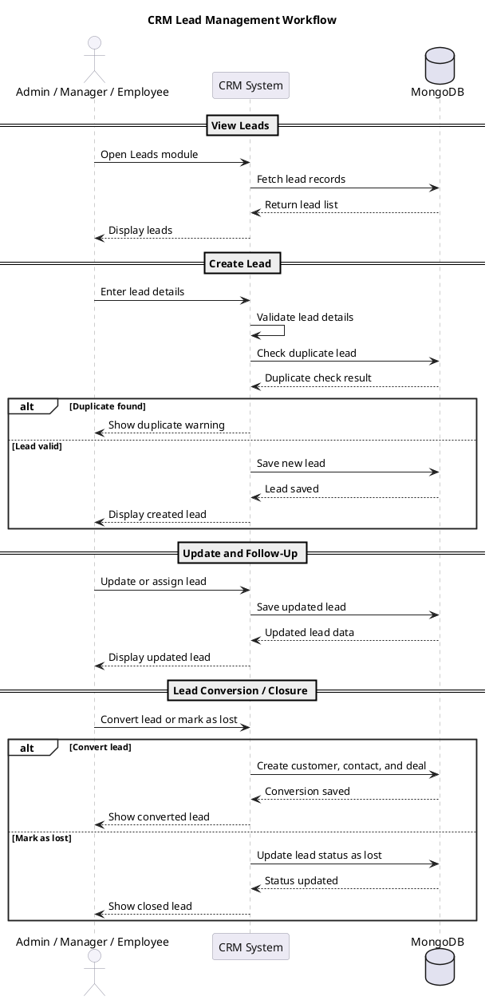

# 3.5.2 CRM Lead Management Workflow

**Figure 3.3: Sequence Diagram Depicting the Lead Management Workflow in the CRM System**

The sequence diagram above illustrates the basic lead management process in the CRM system. It shows how a user views leads, creates a new lead, updates lead details, and converts or closes a lead. The workflow highlights the interaction between the CRM user, the CRM system, and the MongoDB database.

a. **View Leads:**

- The Admin, Manager, or Employee opens the Leads module.
- The CRM system fetches available leads from the database.
- The leads are displayed to the user in the lead list or board.

b. **Create Lead:**

- The user enters lead details such as name, email, phone, company, source, and product/service interest.
- The CRM system validates the lead information.
- The system checks the database for duplicate leads.
- If the lead is valid and not duplicate, it is saved in the database.

c. **Update or Assign Lead:**

- The user updates lead information, assigns the lead, or records follow-up details.
- The CRM system saves the updated lead details in the database.
- The updated lead information is displayed to the user.

d. **Lead Conversion or Closure:**

- If the lead is qualified, the user converts it into a customer, contact, and deal.
- If the lead is not successful, it can be marked as lost.
- The CRM system updates the final lead status in the database and shows the result to the user.

This workflow ensures simple lead tracking, duplicate checking, proper follow-up management, and smooth conversion of qualified leads into business records.

```mermaid
sequenceDiagram
  actor User as Admin / Manager / Employee
  participant CRM as CRM System
  database DB as MongoDB

  rect rgb(245, 245, 250)
    note over User,DB: View Leads
    User->>CRM: Open Leads module
    CRM->>DB: Fetch lead records
    DB-->>CRM: Return lead list
    CRM-->>User: Display leads
  end

  rect rgb(245, 245, 250)
    note over User,DB: Create Lead
    User->>CRM: Enter lead details
    CRM->>CRM: Validate lead details
    CRM->>DB: Check duplicate lead
    DB-->>CRM: Duplicate check result

    alt Duplicate found
      CRM-->>User: Show duplicate warning
    else Lead valid
      CRM->>DB: Save new lead
      DB-->>CRM: Lead saved
      CRM-->>User: Display created lead
    end
  end

  rect rgb(245, 245, 250)
    note over User,DB: Update and Follow-Up
    User->>CRM: Update or assign lead
    CRM->>DB: Save updated lead
    DB-->>CRM: Updated lead data
    CRM-->>User: Display updated lead
  end

  rect rgb(245, 245, 250)
    note over User,DB: Lead Conversion / Closure
    User->>CRM: Convert lead or mark as lost

    alt Convert lead
      CRM->>DB: Create customer, contact, and deal
      DB-->>CRM: Conversion saved
      CRM-->>User: Show converted lead
    else Mark as lost
      CRM->>DB: Update lead status as lost
      DB-->>CRM: Status updated
      CRM-->>User: Show closed lead
    end
  end
```

## PlantUML Version

Use this version if you need a diagram style closer to the sample image, with simple grouped sections.


