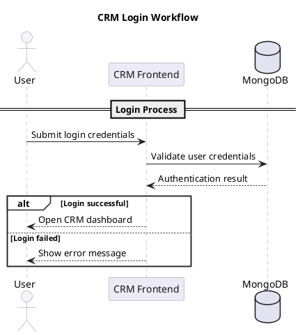

# 3.5.1 CRM User Login Workflow

**Figure 3.2: Sequence Diagram Depicting the End-to-End Login Workflow of a User Accessing the CRM System**

The sequence diagram above illustrates the login process followed by a user to access the CRM system. It shows how the user submits credentials, how the CRM system verifies them with the database, and how access is either granted or denied.

a. **Login Request:**

- The user enters an email/username and password on the CRM login page.
- The CRM frontend sends the login details to the authentication system.

b. **Credential Verification:**

- The authentication system checks the submitted credentials with the MongoDB user collection.
- The database returns whether the user details are valid or invalid.

c. **Login Result:**

- If the credentials are valid, the user is redirected to the CRM dashboard.
- If the credentials are invalid, an error message is displayed.

This workflow ensures secure login, reliable user verification, and controlled access to the CRM dashboard for Admin, Manager, and Employee users.

```mermaid
sequenceDiagram
  actor User
  participant CRM as CRM Frontend
  database DB as MongoDB

  rect rgb(245, 245, 250)
    note over User,DB: Login Process
    User->>CRM: Submit login credentials
    CRM->>DB: Validate user credentials
    DB-->>CRM: Authentication result

    alt Login successful
      CRM-->>User: Open CRM dashboard
    else Login failed
      CRM-->>User: Show error message
    end
  end
```

## PlantUML Version

Use this version if you need a diagram style closer to the sample image, with pale participant boxes and a simple grouped login section.


